<center>
</center>

<p style="font-family: times, serif; font-size:18pt; font-style:italic">
“Everything negative – pressure, challenges – is all an opportunity for me to rise.”
</p>
<div style="text-align: right"> **Kobe Bryant** </div>

# **Introduction**

I am a big fan of basketball, and in this entry we are going to analyze a data set from Kaggle containing the location and circumstances of every field goal attempted by Kobe Bryant
took during his 20-year career. We are going to use the [tidyverse](https://cran.r-project.org/web/packages/tidyverse/index.html) package for data manipulation, exploration and visualization. 
Some context information (Reference **[here](https://en.wikipedia.org/wiki/Kobe_Bryant)**): 

> Kobe Bean Bryant (born August 23, 1978) is an American former professional basketball player. He played his entire 20-year career with the Los Angeles Lakers of the National Basketball Association (NBA). He entered the NBA directly from high school and won five NBA championships with the Lakers. Bryant is an 18-time All-Star, 15-time member of the All-NBA Team, and 12-time member of the All-Defensive team. He led the NBA in scoring during two seasons and ranks third on the league's all-time regular season scoring and fourth on the all-time postseason scoring list. He holds the NBA record for the most seasons playing with one franchise for an entire career and is widely regarded as one of the greatest basketball players of all time. Bryant is the first guard in NBA history to play at least 20 seasons.

By the way, if you like basketball, you can also check these other kernels:

* [Michael Jordan vs Kobe Bryant vs Lebron James](https://www.kaggle.com/xvivancos/michael-jordan-vs-kobe-bryant-vs-lebron-james)

* [EDA - Tweets during Cleveland Cavaliers vs Golden State Warriors](https://www.kaggle.com/xvivancos/eda-tweets-during-cavaliers-vs-warriors)

* [How good is Luka Doncic?](https://www.kaggle.com/xvivancos/how-good-is-luka-doncic)

# **Loading data** {.tabset .tabset-fade .tabset-pills}


```r
# Load libraries
library(ggplot2)
library(tidyverse)
library(gridExtra)
library(knitr)
library(RCurl)
library(grid)
library(jpeg)
# Read the stats
shots <- read.csv('~/Desktop/dataframe/Spring2020/Kobedata.csv',stringsAsFactors=FALSE)
```

Let’s get an idea of what we’re working with.

## Structure 

```r
# Structure
str(shots)
```

```
## 'data.frame':	30697 obs. of  25 variables:
##  $ action_type       : chr  "Jump Shot" "Jump Shot" "Jump Shot" "Jump Shot" ...
##  $ combined_shot_type: chr  "Jump Shot" "Jump Shot" "Jump Shot" "Jump Shot" ...
##  $ game_event_id     : int  10 12 35 43 155 244 251 254 265 294 ...
##  $ game_id           : int  20000012 20000012 20000012 20000012 20000012 20000012 20000012 20000012 20000012 20000012 ...
##  $ lat               : num  34 34 33.9 33.9 34 ...
##  $ loc_x             : int  167 -157 -101 138 0 -145 0 1 -65 -33 ...
##  $ loc_y             : int  72 0 135 175 0 -11 0 28 108 125 ...
##  $ lon               : num  -118 -118 -118 -118 -118 ...
##  $ minutes_remaining : int  10 10 7 6 6 9 8 8 6 3 ...
##  $ period            : int  1 1 1 1 2 3 3 3 3 3 ...
##  $ playoffs          : int  0 0 0 0 0 0 0 0 0 0 ...
##  $ season            : chr  "2000-01" "2000-01" "2000-01" "2000-01" ...
##  $ seconds_remaining : int  27 22 45 52 19 32 52 5 12 36 ...
##  $ shot_distance     : int  18 15 16 22 0 14 0 2 12 12 ...
##  $ shot_made_flag    : int  NA 0 1 0 1 0 1 NA 1 0 ...
##  $ shot_type         : chr  "2PT Field Goal" "2PT Field Goal" "2PT Field Goal" "2PT Field Goal" ...
##  $ shot_zone_area    : chr  "Right Side(R)" "Left Side(L)" "Left Side Center(LC)" "Right Side Center(RC)" ...
##  $ shot_zone_basic   : chr  "Mid-Range" "Mid-Range" "Mid-Range" "Mid-Range" ...
##  $ shot_zone_range   : chr  "16-24 ft." "8-16 ft." "16-24 ft." "16-24 ft." ...
##  $ team_id           : int  1610612747 1610612747 1610612747 1610612747 1610612747 1610612747 1610612747 1610612747 1610612747 1610612747 ...
##  $ team_name         : chr  "Los Angeles Lakers" "Los Angeles Lakers" "Los Angeles Lakers" "Los Angeles Lakers" ...
##  $ game_date         : chr  "2000-10-31" "2000-10-31" "2000-10-31" "2000-10-31" ...
##  $ matchup           : chr  "LAL @ POR" "LAL @ POR" "LAL @ POR" "LAL @ POR" ...
##  $ opponent          : chr  "POR" "POR" "POR" "POR" ...
##  $ shot_id           : int  1 2 3 4 5 6 7 8 9 10 ...
```

## Summary 

```r
# Summary
summary(shots)
```

```
##  action_type        combined_shot_type game_event_id      game_id              lat            loc_x         
##  Length:30697       Length:30697       Min.   :  2.0   Min.   :20000012   Min.   :33.25   Min.   :-250.000  
##  Class :character   Class :character   1st Qu.:110.0   1st Qu.:20500077   1st Qu.:33.88   1st Qu.: -68.000  
##  Mode  :character   Mode  :character   Median :253.0   Median :20900354   Median :33.97   Median :   0.000  
##                                        Mean   :249.2   Mean   :24764066   Mean   :33.95   Mean   :   7.111  
##                                        3rd Qu.:368.0   3rd Qu.:29600474   3rd Qu.:34.04   3rd Qu.:  95.000  
##                                        Max.   :659.0   Max.   :49900088   Max.   :34.09   Max.   : 248.000  
##                                                                                                             
##      loc_y             lon         minutes_remaining     period         playoffs         season         
##  Min.   :-44.00   Min.   :-118.5   Min.   : 0.000    Min.   :1.000   Min.   :0.0000   Length:30697      
##  1st Qu.:  4.00   1st Qu.:-118.3   1st Qu.: 2.000    1st Qu.:1.000   1st Qu.:0.0000   Class :character  
##  Median : 74.00   Median :-118.3   Median : 5.000    Median :3.000   Median :0.0000   Mode  :character  
##  Mean   : 91.11   Mean   :-118.3   Mean   : 4.886    Mean   :2.519   Mean   :0.1466                     
##  3rd Qu.:160.00   3rd Qu.:-118.2   3rd Qu.: 8.000    3rd Qu.:3.000   3rd Qu.:0.0000                     
##  Max.   :791.00   Max.   :-118.0   Max.   :11.000    Max.   :7.000   Max.   :1.0000                     
##                                                                                                         
##  seconds_remaining shot_distance   shot_made_flag   shot_type         shot_zone_area     shot_zone_basic   
##  Min.   : 0.00     Min.   : 0.00   Min.   :0.000   Length:30697       Length:30697       Length:30697      
##  1st Qu.:13.00     1st Qu.: 5.00   1st Qu.:0.000   Class :character   Class :character   Class :character  
##  Median :28.00     Median :15.00   Median :0.000   Mode  :character   Mode  :character   Mode  :character  
##  Mean   :28.37     Mean   :13.44   Mean   :0.446                                                           
##  3rd Qu.:43.00     3rd Qu.:21.00   3rd Qu.:1.000                                                           
##  Max.   :59.00     Max.   :79.00   Max.   :1.000                                                           
##                                    NA's   :5000                                                            
##  shot_zone_range       team_id           team_name          game_date           matchup         
##  Length:30697       Min.   :1.611e+09   Length:30697       Length:30697       Length:30697      
##  Class :character   1st Qu.:1.611e+09   Class :character   Class :character   Class :character  
##  Mode  :character   Median :1.611e+09   Mode  :character   Mode  :character   Mode  :character  
##                     Mean   :1.611e+09                                                           
##                     3rd Qu.:1.611e+09                                                           
##                     Max.   :1.611e+09                                                           
##                                                                                                 
##    opponent            shot_id     
##  Length:30697       Min.   :    1  
##  Class :character   1st Qu.: 7675  
##  Mode  :character   Median :15349  
##                     Mean   :15349  
##                     3rd Qu.:23023  
##                     Max.   :30697  
## 
```

## Head 

```r
# View first 6 rows
head(shots)
```

```
##         action_type combined_shot_type game_event_id  game_id     lat loc_x loc_y       lon minutes_remaining
## 1         Jump Shot          Jump Shot            10 20000012 33.9723   167    72 -118.1028                10
## 2         Jump Shot          Jump Shot            12 20000012 34.0443  -157     0 -118.4268                10
## 3         Jump Shot          Jump Shot            35 20000012 33.9093  -101   135 -118.3708                 7
## 4         Jump Shot          Jump Shot            43 20000012 33.8693   138   175 -118.1318                 6
## 5 Driving Dunk Shot               Dunk           155 20000012 34.0443     0     0 -118.2698                 6
## 6         Jump Shot          Jump Shot           244 20000012 34.0553  -145   -11 -118.4148                 9
##   period playoffs  season seconds_remaining shot_distance shot_made_flag      shot_type        shot_zone_area
## 1      1        0 2000-01                27            18             NA 2PT Field Goal         Right Side(R)
## 2      1        0 2000-01                22            15              0 2PT Field Goal          Left Side(L)
## 3      1        0 2000-01                45            16              1 2PT Field Goal  Left Side Center(LC)
## 4      1        0 2000-01                52            22              0 2PT Field Goal Right Side Center(RC)
## 5      2        0 2000-01                19             0              1 2PT Field Goal             Center(C)
## 6      3        0 2000-01                32            14              0 2PT Field Goal          Left Side(L)
##   shot_zone_basic shot_zone_range    team_id          team_name  game_date   matchup opponent shot_id
## 1       Mid-Range       16-24 ft. 1610612747 Los Angeles Lakers 2000-10-31 LAL @ POR      POR       1
## 2       Mid-Range        8-16 ft. 1610612747 Los Angeles Lakers 2000-10-31 LAL @ POR      POR       2
## 3       Mid-Range       16-24 ft. 1610612747 Los Angeles Lakers 2000-10-31 LAL @ POR      POR       3
## 4       Mid-Range       16-24 ft. 1610612747 Los Angeles Lakers 2000-10-31 LAL @ POR      POR       4
## 5 Restricted Area Less Than 8 ft. 1610612747 Los Angeles Lakers 2000-10-31 LAL @ POR      POR       5
## 6       Mid-Range        8-16 ft. 1610612747 Los Angeles Lakers 2000-10-31 LAL @ POR      POR       6
```

## Tail 

```r
# View last 6 rows
tail(shots)
```

```
##              action_type combined_shot_type game_event_id  game_id     lat loc_x loc_y       lon
## 30692 Driving Layup Shot              Layup           382 49900088 34.0443     0     0 -118.2698
## 30693          Jump Shot          Jump Shot           397 49900088 33.9963     1    48 -118.2688
## 30694           Tip Shot           Tip Shot           398 49900088 34.0443     0     0 -118.2698
## 30695  Running Jump Shot          Jump Shot           426 49900088 33.8783  -134   166 -118.4038
## 30696          Jump Shot          Jump Shot           448 49900088 33.7773    31   267 -118.2388
## 30697          Jump Shot          Jump Shot           471 49900088 33.9723     1    72 -118.2688
##       minutes_remaining period playoffs  season seconds_remaining shot_distance shot_made_flag      shot_type
## 30692                 7      4        1 1999-00                 4             0              0 2PT Field Goal
## 30693                 6      4        1 1999-00                 5             4              0 2PT Field Goal
## 30694                 6      4        1 1999-00                 5             0             NA 2PT Field Goal
## 30695                 3      4        1 1999-00                28            21              1 2PT Field Goal
## 30696                 2      4        1 1999-00                10            26              0 3PT Field Goal
## 30697                 0      4        1 1999-00                39             7              0 2PT Field Goal
##             shot_zone_area       shot_zone_basic shot_zone_range    team_id          team_name  game_date
## 30692            Center(C)       Restricted Area Less Than 8 ft. 1610612747 Los Angeles Lakers 2000-06-19
## 30693            Center(C) In The Paint (Non-RA) Less Than 8 ft. 1610612747 Los Angeles Lakers 2000-06-19
## 30694            Center(C)       Restricted Area Less Than 8 ft. 1610612747 Los Angeles Lakers 2000-06-19
## 30695 Left Side Center(LC)             Mid-Range       16-24 ft. 1610612747 Los Angeles Lakers 2000-06-19
## 30696            Center(C)     Above the Break 3         24+ ft. 1610612747 Los Angeles Lakers 2000-06-19
## 30697            Center(C) In The Paint (Non-RA) Less Than 8 ft. 1610612747 Los Angeles Lakers 2000-06-19
##           matchup opponent shot_id
## 30692 LAL vs. IND      IND   30692
## 30693 LAL vs. IND      IND   30693
## 30694 LAL vs. IND      IND   30694
## 30695 LAL vs. IND      IND   30695
## 30696 LAL vs. IND      IND   30696
## 30697 LAL vs. IND      IND   30697
```

There are some NAs in the `shot_made_flag` column. We can remove all rows with missing values using the `na.omit()` function.


```r
# Remove rows with NAs
shots <- na.omit(shots)
```

# **Data Analysis**  

## Shot type 


```r
# half court image
courtImg.URL <- "https://thedatagame.files.wordpress.com/2016/03/nba_court.jpg"
court <- rasterGrob(readJPEG(getURLContent(courtImg.URL)),
                    width=unit(1,"npc"), height=unit(1,"npc"))

# Shot type
ggplot() + 
  annotation_custom(court, -250, 250, -50, 420)+
  
  # We use a different alpha value for jump shots to improve the visualization
  geom_point(data=shots %>% filter(combined_shot_type=="Jump Shot"),
             aes(x=loc_x, y=loc_y), colour="grey", alpha=0.3) +
  geom_point(data=shots %>% filter(combined_shot_type!="Jump Shot"),
             aes(x=loc_x, y=loc_y, colour=combined_shot_type), alpha=0.8) +
  labs(title="Shot type") +
  ylim(c(-50, 420)) 
```

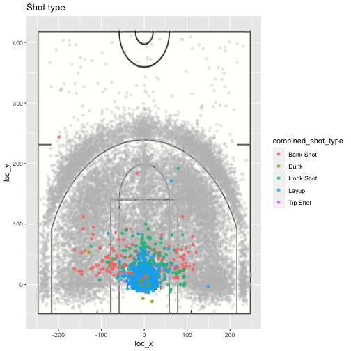

As we see, most points in the visualization correspond to jump shots. 

## Shot zone


```r
# Shot zone range
p1 <- ggplot(shots, aes(x=lon, y=lat)) +
  geom_point(aes(color=shot_zone_range)) +
  labs(title="Shot zone range") +
  ylim(c(33.7, 34.0883)) +
  theme_void() +
  theme(legend.position="none",
        plot.title=element_text(hjust=0.5)) 

# Frequency for each shot zone range
p2 <- ggplot(shots, aes(x=fct_infreq(shot_zone_range))) + 
  geom_bar(aes(fill=shot_zone_range)) +
  labs(y="Frequency") +
  theme_bw() +
  theme(axis.title.x=element_blank(), 
        legend.position="none")

# Subplot
grid.arrange(p1, p2, layout_matrix=cbind(c(1,2)))
```

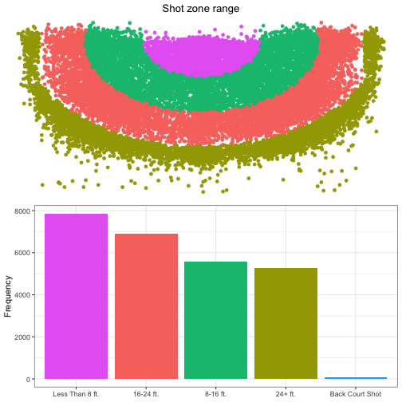


```r
# Shot zone area
p3 <- ggplot(shots, aes(x=lon, y=lat)) +
  geom_point(aes(colour=shot_zone_area)) +
  labs(title="Shot zone area") +
  ylim(c(33.7, 34.0883)) +
  theme_void() +
  theme(legend.position="none",
        plot.title=element_text(hjust=0.5)) 

# Frequency for each shot zone area
p4 <- ggplot(shots, aes(x=fct_infreq(shot_zone_area))) + 
  geom_bar(aes(fill=shot_zone_area)) +
  labs(y="Frequency") +
  theme_bw() +
  theme(axis.text.x=element_text(size=7),
        axis.title.x=element_blank(), 
        legend.position="none")

# Subplot
grid.arrange(p3, p4, layout_matrix=cbind(c(1,2)))
```

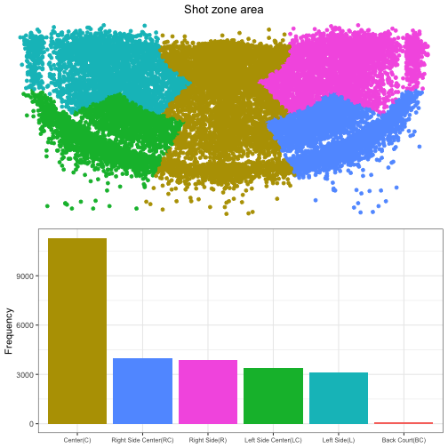


```r
# Shot zone basic
p5 <- ggplot(shots, aes(x=lon, y=lat)) +
  geom_point(aes(color=shot_zone_basic)) +
  labs(title="Shot zone basic") +
  ylim(c(33.7, 34.0883)) +
  theme_void() +
  theme(legend.position="none",
        plot.title=element_text(hjust=0.5))

# Frequency for each shot zone basic
p6 <- ggplot(shots, aes(x=fct_infreq(shot_zone_basic))) + 
  geom_bar(aes(fill=shot_zone_basic)) +
  labs(y="Frequency") +
  theme_bw() +
  theme(axis.text.x=element_text(size=6.3),
        axis.title.x=element_blank(), 
        legend.position="none")

# Subplot
grid.arrange(p5, p6, layout_matrix=cbind(c(1,2)))
```

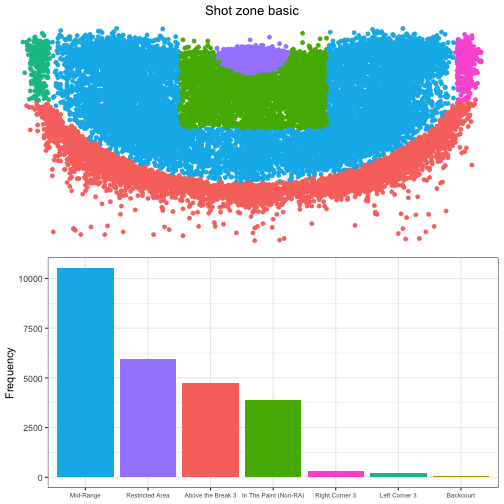

## Shot accuracy 


```r
# Accuracy by shot type 
shots %>%
  group_by(action_type) %>%
  summarise(Accuracy=mean(shot_made_flag),
            counts=n()) %>%
  filter(counts>20) %>%
  ggplot(aes(x=reorder(action_type, Accuracy), y=Accuracy)) + 
  geom_point(aes(colour=Accuracy), size=3) +
  scale_colour_gradient(low="orangered", high="chartreuse3") +
  labs(title="Accuracy by shot type") +
  theme_bw() +
  theme(axis.title.y=element_blank(),
        legend.position="none",
        plot.title=element_text(hjust=0.5)) +
  coord_flip()
```

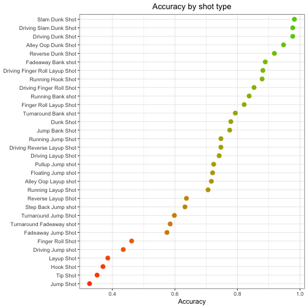


```r
# Accuracy by season
shots %>%
  group_by(season) %>%
  summarise(Accuracy=mean(shot_made_flag)) %>%
  ggplot(aes(x=season, y=Accuracy, group=1)) +
  geom_line(aes(colour=Accuracy)) +
  geom_point(aes(colour=Accuracy), size=3) +
  scale_colour_gradient(low="orangered", high="chartreuse3") +
  labs(title="Accuracy by season", x="Season") +
  theme_bw() +
  theme(legend.position="none",
        axis.text.x=element_text(angle=45, hjust=1),
        plot.title=element_text(hjust=0.5)) 
```

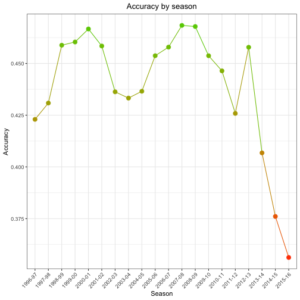

As we see, the accuracy begins to decrease badly from the 2013-14 season. Why didn't you retire before, Kobe?


```r
# Accuracy by season in Playoff and Regular Season
shots %>%
  group_by(season) %>%
  summarise(Playoff=mean(shot_made_flag[playoffs==1]),
            RegularSeason=mean(shot_made_flag[playoffs==0])) %>%
  ggplot(aes(x=season, group=1)) +
  geom_line(aes(y=Playoff, colour="Playoff")) +
  geom_line(aes(y=RegularSeason, colour="RegularSeason")) +
  geom_point(aes(y=Playoff, colour="Playoff"), size=3) +
  geom_point(aes(y=RegularSeason, colour="RegularSeason"), size=3) +
  labs(title="Accuracy by season", 
       subtitle="Playoff and Regular Season",
       x="Season", y="Accuracy") +
  theme_bw() +
  theme(legend.title=element_blank(),
        legend.position="bottom",
        axis.text.x=element_text(angle=45, hjust=1),
        plot.title=element_text(hjust=0.5),
        plot.subtitle=element_text(hjust=0.5)) 
```

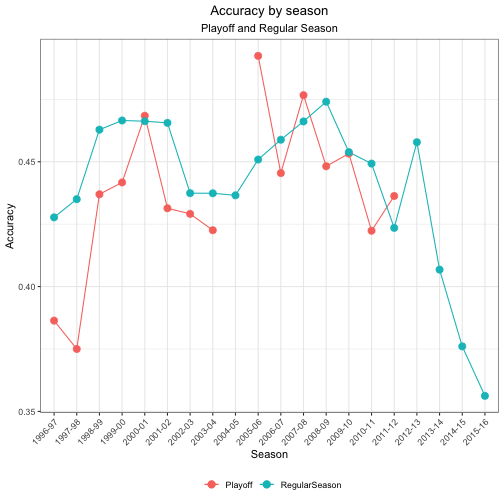

Notice that the red line is discontinuous because in some seasons Los Angeles Lakers couldn't make the NBA Playoff.


```r
# Accuracy by season in 2PT Field Goal and 3PT Field Goal
shots %>%
  group_by(season) %>%
  summarise(TwoPoint=mean(shot_made_flag[shot_type=="2PT Field Goal"]),
            ThreePoint=mean(shot_made_flag[shot_type=="3PT Field Goal"])) %>%
  ggplot(aes(x=season, group=1)) +
  geom_line(aes(y=TwoPoint, colour="TwoPoint")) +
  geom_line(aes(y=ThreePoint, colour="ThreePoint")) +
  geom_point(aes(y=TwoPoint, colour="TwoPoint"), size=3) +
  geom_point(aes(y=ThreePoint, colour="ThreePoint"), size=3) +
  labs(title="Accuracy by season", 
       subtitle="2PT Field Goal and 3PT Field Goal",
       x="Season", y="Accuracy") +
  theme_bw() +
  theme(legend.title=element_blank(),
        legend.position="bottom",
        axis.text.x=element_text(angle=45, hjust=1),
        plot.title=element_text(hjust=0.5),
        plot.subtitle=element_text(hjust=0.5)) 
```

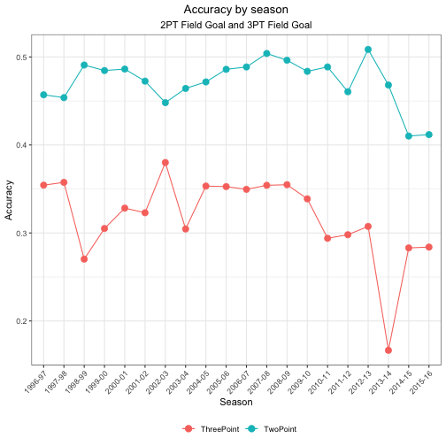

What the hell happened in the 2013-2014 season? That 3P% is extremely low!


```r
# Accuracy by shot distance
shots %>%
  group_by(shot_distance) %>%
  summarise(Accuracy=mean(shot_made_flag)) %>%
  ggplot(aes(x=shot_distance, y=Accuracy)) + 
  geom_line(aes(colour=Accuracy)) +
  geom_point(aes(colour=Accuracy), size=2) +
  scale_colour_gradient(low="orangered", high="chartreuse3") +
  labs(title="Accuracy by shot distance", x="Shot distance (ft.)") +
  xlim(c(0,45)) +
  theme_bw() +
  theme(legend.position="none",
        plot.title=element_text(hjust=0.5)) 
```

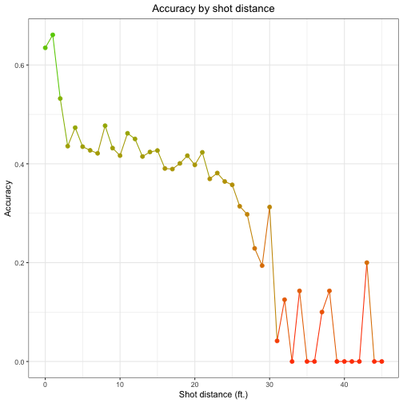


```r
# Accuracy by shot zone range
p7 <- shots %>%
  select(lat, lon, shot_zone_range, shot_made_flag) %>%
  group_by(shot_zone_range) %>%
  mutate(Accuracy=mean(shot_made_flag)) %>%
  ggplot(aes(x=lon, y=lat)) +
  geom_point(aes(colour=Accuracy)) +
  scale_colour_gradient(low="red", high="lightgreen") +
  labs(title="Accuracy by shot zone range") +
  ylim(c(33.7, 34.0883)) +
  theme_void() +
  theme(plot.title=element_text(hjust=0.5))

# Accuracy by shot zone area
p8 <- shots %>%
  select(lat, lon, shot_zone_area, shot_made_flag) %>%
  group_by(shot_zone_area) %>%
  mutate(Accuracy=mean(shot_made_flag)) %>%
  ggplot(aes(x=lon, y=lat)) +
  geom_point(aes(colour=Accuracy)) +
  scale_colour_gradient(low="red", high="lightgreen") +
  labs(title="Accuracy by shot zone area") +
  ylim(c(33.7, 34.0883)) +
  theme_void() +
  theme(legend.position="none",
        plot.title=element_text(hjust=0.5))

# Accuracy by shot zone basic
p9 <- shots %>%
  select(lat, lon, shot_zone_basic, shot_made_flag) %>%
  group_by(shot_zone_basic) %>%
  mutate(Accuracy=mean(shot_made_flag)) %>%
  ggplot(aes(x=lon, y=lat)) +
  geom_point(aes(colour=Accuracy)) +
  scale_colour_gradient(low="red", high="lightgreen") +
  labs(title="Accuracy by shot zone basic") +
  ylim(c(33.7, 34.0883)) +
  theme_void() +
  theme(legend.position="none",
        plot.title=element_text(hjust=0.5))

# Subplots
grid.arrange(p7, p8, p9, layout_matrix=cbind(c(1,2), c(1,3)))
```

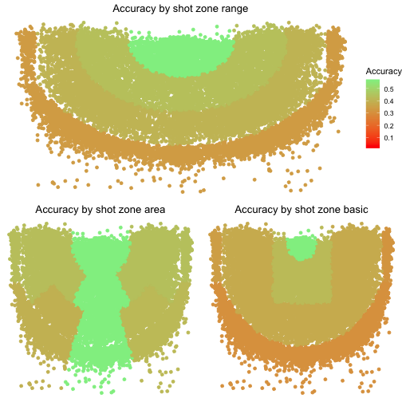


```r
# Accuracy by minutes remaining
shots %>%
  group_by(minutes_remaining) %>%
  summarise(Accuracy=mean(shot_made_flag)) %>%
  ggplot(aes(x=minutes_remaining, y=Accuracy)) + 
  geom_bar(aes(fill=Accuracy), stat="identity") +
  scale_fill_gradient(low="orangered", high="chartreuse3") +
  labs(title="Accuracy by minutes remaining", x="Minutes remaining")  +
  theme_bw() +
  theme(legend.position="none",
        plot.title=element_text(hjust=0.5)) 
```

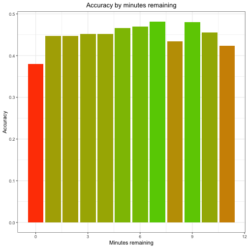


```r
# Accuracy by seconds remaining
shots %>%
  group_by(seconds_remaining) %>%
  summarise(Accuracy=mean(shot_made_flag)) %>%
  ggplot(aes(x=seconds_remaining, y=Accuracy)) + 
  geom_bar(aes(fill=Accuracy), stat="identity") +
  scale_fill_gradient(low="orangered", high="chartreuse3") +
  labs(title="Accuracy by seconds remaining", x="Seconds remaining")  +
  theme_bw() +
  theme(legend.position="none",
        plot.title=element_text(hjust=0.5)) 
```

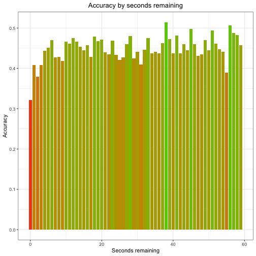


```r
# Accuracy by opponent
shots %>%
  group_by(opponent) %>%
  summarise(Accuracy=mean(shot_made_flag)) %>%
  mutate(Conference=c("Eastern", "Eastern", "Eastern", "Eastern", "Eastern",
                      "Eastern", "Western", "Western", "Eastern", "Western",
                      "Western", "Eastern", "Western", "Western", "Eastern",
                      "Eastern", "Western", "Eastern", "Western", "Western",
                      "Eastern", "Western", "Eastern", "Eastern", "Western",
                      "Western", "Western", "Western", "Western", "Eastern",
                      "Western", "Western", "Eastern" )) %>%
  ggplot(aes(x=reorder(opponent, -Accuracy), y=Accuracy)) + 
  geom_bar(aes(fill=Conference), stat="identity") +
  labs(title="Accuracy by opponent", x="Opponent") +
  theme_bw() +
  theme(legend.position="bottom",
        legend.title=element_blank(),
        axis.text.x=element_text(angle=45, hjust=1),
        plot.title=element_text(hjust=0.5))  
```

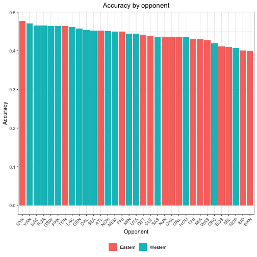


```r
# Accuracy by opponent in 2PT Field Goal and 3PT Field Goal
shots %>%
  group_by(opponent) %>%
  summarise(TwoPoint=mean(shot_made_flag[shot_type=="2PT Field Goal"]),
            ThreePoint=mean(shot_made_flag[shot_type=="3PT Field Goal"])) %>%
  ggplot(aes(x=opponent, group=1)) +
  geom_line(aes(y=TwoPoint, colour="TwoPoint")) +
  geom_line(aes(y=ThreePoint, colour="ThreePoint")) +
  geom_point(aes(y=TwoPoint, colour="TwoPoint"), size=3) +
  geom_point(aes(y=ThreePoint, colour="ThreePoint"), size=3) +
  labs(title="Accuracy by opponent", 
       subtitle="2PT Field Goal and 3PT Field Goal",
       x="Opponent", y="Accuracy") +
  theme_bw() +
  theme(legend.title=element_blank(),
        legend.position="bottom",
        axis.text.x=element_text(angle=45, hjust=1),
        plot.title=element_text(hjust=0.5),
        plot.subtitle=element_text(hjust=0.5)) 
```

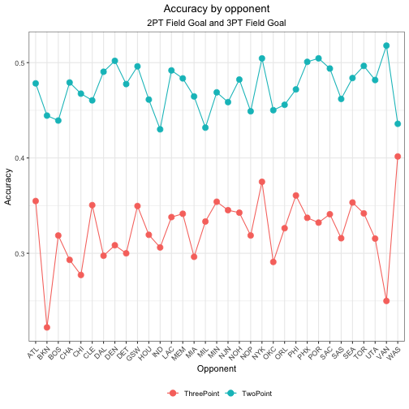


# **Models** 

```r
# Load libraries
library(tidyverse)
library(gridExtra)
library(knitr)
library(class)
library(neuralnet)
library(kknn)
library(caret)
library(pROC)
library(mlbench)
library(e1071)
```

## svm model

```r
setwd("~/Desktop/dataframe/Spring2020")
input <- read.csv("Kobedata.csv", sep = "," ,stringsAsFactors = FALSE)
train <- input[!is.na(input$shot_made_flag),]
test <- input[is.na(input$shot_made_flag),]
train$shot_made_flag <- as.factor(train$shot_made_flag)
train$shot_made_flag <- factor(train$shot_made_flag, levels = c("1", "0"))
```


```r
#handle with the train features
train$shot_distance[train$shot_distance>40] <- 40
train$time_remaining <- train$minutes_remaining*60+train$seconds_remaining;
str(train)
```

```
## 'data.frame':	25697 obs. of  26 variables:
##  $ action_type       : chr  "Jump Shot" "Jump Shot" "Jump Shot" "Driving Dunk Shot" ...
##  $ combined_shot_type: chr  "Jump Shot" "Jump Shot" "Jump Shot" "Dunk" ...
##  $ game_event_id     : int  12 35 43 155 244 251 265 294 309 4 ...
##  $ game_id           : int  20000012 20000012 20000012 20000012 20000012 20000012 20000012 20000012 20000012 20000019 ...
##  $ lat               : num  34 33.9 33.9 34 34.1 ...
##  $ loc_x             : int  -157 -101 138 0 -145 0 -65 -33 -94 121 ...
##  $ loc_y             : int  0 135 175 0 -11 0 108 125 238 127 ...
##  $ lon               : num  -118 -118 -118 -118 -118 ...
##  $ minutes_remaining : int  10 7 6 6 9 8 6 3 1 11 ...
##  $ period            : int  1 1 1 2 3 3 3 3 3 1 ...
##  $ playoffs          : int  0 0 0 0 0 0 0 0 0 0 ...
##  $ season            : chr  "2000-01" "2000-01" "2000-01" "2000-01" ...
##  $ seconds_remaining : int  22 45 52 19 32 52 12 36 56 0 ...
##  $ shot_distance     : num  15 16 22 0 14 0 12 12 25 17 ...
##  $ shot_made_flag    : Factor w/ 2 levels "1","0": 2 1 2 1 2 1 1 2 2 1 ...
##  $ shot_type         : chr  "2PT Field Goal" "2PT Field Goal" "2PT Field Goal" "2PT Field Goal" ...
##  $ shot_zone_area    : chr  "Left Side(L)" "Left Side Center(LC)" "Right Side Center(RC)" "Center(C)" ...
##  $ shot_zone_basic   : chr  "Mid-Range" "Mid-Range" "Mid-Range" "Restricted Area" ...
##  $ shot_zone_range   : chr  "8-16 ft." "16-24 ft." "16-24 ft." "Less Than 8 ft." ...
##  $ team_id           : int  1610612747 1610612747 1610612747 1610612747 1610612747 1610612747 1610612747 1610612747 1610612747 1610612747 ...
##  $ team_name         : chr  "Los Angeles Lakers" "Los Angeles Lakers" "Los Angeles Lakers" "Los Angeles Lakers" ...
##  $ game_date         : chr  "2000-10-31" "2000-10-31" "2000-10-31" "2000-10-31" ...
##  $ matchup           : chr  "LAL @ POR" "LAL @ POR" "LAL @ POR" "LAL @ POR" ...
##  $ opponent          : chr  "POR" "POR" "POR" "POR" ...
##  $ shot_id           : int  2 3 4 5 6 7 9 10 11 12 ...
##  $ time_remaining    : num  622 465 412 379 572 532 372 216 116 660 ...
```


```r
#normalize function
myNormalize <- function (target) {
  (target - min(target))/(max(target) - min(target))
}
train$shot_distance <- myNormalize(train$shot_distance)
train$time_remaining <- myNormalize(train$time_remaining)
```


```r
# show the data
head(train)
```

```
##         action_type combined_shot_type game_event_id  game_id     lat loc_x loc_y       lon minutes_remaining
## 2         Jump Shot          Jump Shot            12 20000012 34.0443  -157     0 -118.4268                10
## 3         Jump Shot          Jump Shot            35 20000012 33.9093  -101   135 -118.3708                 7
## 4         Jump Shot          Jump Shot            43 20000012 33.8693   138   175 -118.1318                 6
## 5 Driving Dunk Shot               Dunk           155 20000012 34.0443     0     0 -118.2698                 6
## 6         Jump Shot          Jump Shot           244 20000012 34.0553  -145   -11 -118.4148                 9
## 7        Layup Shot              Layup           251 20000012 34.0443     0     0 -118.2698                 8
##   period playoffs  season seconds_remaining shot_distance shot_made_flag      shot_type        shot_zone_area
## 2      1        0 2000-01                22         0.375              0 2PT Field Goal          Left Side(L)
## 3      1        0 2000-01                45         0.400              1 2PT Field Goal  Left Side Center(LC)
## 4      1        0 2000-01                52         0.550              0 2PT Field Goal Right Side Center(RC)
## 5      2        0 2000-01                19         0.000              1 2PT Field Goal             Center(C)
## 6      3        0 2000-01                32         0.350              0 2PT Field Goal          Left Side(L)
## 7      3        0 2000-01                52         0.000              1 2PT Field Goal             Center(C)
##   shot_zone_basic shot_zone_range    team_id          team_name  game_date   matchup opponent shot_id
## 2       Mid-Range        8-16 ft. 1610612747 Los Angeles Lakers 2000-10-31 LAL @ POR      POR       2
## 3       Mid-Range       16-24 ft. 1610612747 Los Angeles Lakers 2000-10-31 LAL @ POR      POR       3
## 4       Mid-Range       16-24 ft. 1610612747 Los Angeles Lakers 2000-10-31 LAL @ POR      POR       4
## 5 Restricted Area Less Than 8 ft. 1610612747 Los Angeles Lakers 2000-10-31 LAL @ POR      POR       5
## 6       Mid-Range        8-16 ft. 1610612747 Los Angeles Lakers 2000-10-31 LAL @ POR      POR       6
## 7 Restricted Area Less Than 8 ft. 1610612747 Los Angeles Lakers 2000-10-31 LAL @ POR      POR       7
##   time_remaining
## 2      0.8711485
## 3      0.6512605
## 4      0.5770308
## 5      0.5308123
## 6      0.8011204
## 7      0.7450980
```


```r
dat <- data.frame(train$shot_distance, train$time_remaining, train$shot_made_flag)
colnames(dat) <- c("shot_distance", "time_remaining", "shot_made_flag")
str(dat)
```

```
## 'data.frame':	25697 obs. of  3 variables:
##  $ shot_distance : num  0.375 0.4 0.55 0 0.35 0 0.3 0.3 0.625 0.425 ...
##  $ time_remaining: num  0.871 0.651 0.577 0.531 0.801 ...
##  $ shot_made_flag: Factor w/ 2 levels "1","0": 2 1 2 1 2 1 1 2 2 1 ...
```


```r
#handle with the test features
test$shot_distance[test$shot_distance>40] <- 40
test$time_remaining <- test$minutes_remaining*60+test$seconds_remaining;
test$shot_distance <- myNormalize(test$shot_distance)
test$time_remaining <- myNormalize(test$time_remaining)
test_dat <- data.frame(test$shot_distance, test$time_remaining, test$shot_made_flag)
colnames(test_dat) <- c("shot_distance", "time_remaining", "shot_made_flag")
head(test_dat)
```

```
##   shot_distance time_remaining shot_made_flag
## 1         0.450    0.883098592             NA
## 2         0.050    0.683098592             NA
## 3         0.000    0.001408451             NA
## 4         0.000    0.909859155             NA
## 5         0.425    0.966197183             NA
## 6         0.500    0.926760563             NA
```


```r
#build svm model by train data
wts=c(1,1)
names(wts)=c(1,0)
model <- svm(shot_made_flag~., data=dat, kernel="radial",  gamma=1, cost=1, class.weights=wts)
print(model)
```

```
## 
## Call:
## svm(formula = shot_made_flag ~ ., data = dat, kernel = "radial", gamma = 1, cost = 1, class.weights = wts)
## 
## 
## Parameters:
##    SVM-Type:  C-classification 
##  SVM-Kernel:  radial 
##        cost:  1 
## 
## Number of Support Vectors:  20876
```


```r
#show accuracy by train dataset
dat.pred <- predict(model, dat[,-3])
svmtable <- table(dat[,3],dat.pred)
print(accuracy.svmtable <- sum(diag(svmtable))/sum(svmtable))
```

```
## [1] 0.6098766
```

## glm model

```r
glmnew <- glm(shot_made_flag ~. , family="binomial",data = dat)
dat.myprediction <- predict(glmnew, dat[,-3])
```


```r
#svm model predict the test data
newdata <- data.frame(test_dat[,-3])
pred <- predict(model, newdata)
head(pred,20)
```

```
##  1  2  3  4  5  6  7  8  9 10 11 12 13 14 15 16 17 18 19 20 
##  0  1  1  1  0  0  1  1  1  0  1  0  0  0  0  0  0  0  0  0 
## Levels: 1 0
```


```r
submission <- data.frame(shot_id=test$shot_id, shot_made_flag=pred)
write.csv(submission, "svm.csv", row.names = F)
```

## KNN model

```r
#build knn model by train data
set.seed(200)
trControl <- trainControl(method = 'repeatedcv',
                          number = 10,
                          repeats = 3)
```


```r
# KNN model prepare
set.seed(200)
fit.shot.20 <- train(shot_made_flag~.,
                  data = dat,
                  method = 'knn',
                  tuneLength = 20,
                  trControl= trControl)
fit.shot.150 <- train(shot_made_flag~.,
                  data = dat,
                  method = 'knn',
                  tuneLength = 150,
                  trControl= trControl)
```


```r
# show the different between the two 
par(mfrow=c(2,1))
plot(fit.shot.20,main = 'fit.shot.20')
```

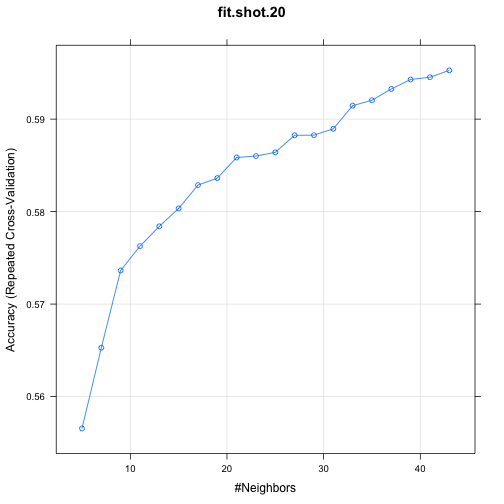

```r
plot(fit.shot.150,main = 'fit.shot.150')
```

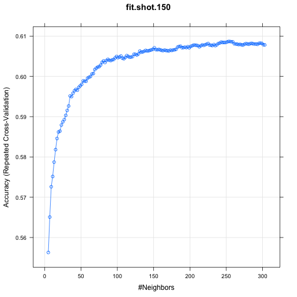


```r
# compare with the two tuneLength
fit.shot.20
```

```
## k-Nearest Neighbors 
## 
## 25697 samples
##     2 predictor
##     2 classes: '1', '0' 
## 
## No pre-processing
## Resampling: Cross-Validated (10 fold, repeated 3 times) 
## Summary of sample sizes: 23128, 23127, 23127, 23128, 23127, 23128, ... 
## Resampling results across tuning parameters:
## 
##   k   Accuracy   Kappa     
##    5  0.5565504  0.09439214
##    7  0.5652797  0.10962633
##    9  0.5736334  0.12457455
##   11  0.5762667  0.12766671
##   13  0.5784072  0.13040561
##   15  0.5803403  0.13319441
##   17  0.5828695  0.13703129
##   19  0.5836220  0.13752480
##   21  0.5858527  0.14083162
##   23  0.5860084  0.14030716
##   25  0.5864108  0.14056477
##   27  0.5882527  0.14376049
##   29  0.5882654  0.14316939
##   31  0.5889532  0.14382728
##   33  0.5914569  0.14832359
##   35  0.5920406  0.14862619
##   37  0.5932599  0.15043913
##   39  0.5942848  0.15228943
##   41  0.5945309  0.15216694
##   43  0.5952703  0.15343343
## 
## Accuracy was used to select the optimal model using the largest value.
## The final value used for the model was k = 43.
```

```r
fit.shot.150
```

```
## k-Nearest Neighbors 
## 
## 25697 samples
##     2 predictor
##     2 classes: '1', '0' 
## 
## No pre-processing
## Resampling: Cross-Validated (10 fold, repeated 3 times) 
## Summary of sample sizes: 23128, 23127, 23126, 23128, 23127, 23127, ... 
## Resampling results across tuning parameters:
## 
##   k    Accuracy   Kappa     
##     5  0.5562773  0.09371807
##     7  0.5650726  0.10925632
##     9  0.5725960  0.12229419
##    11  0.5751514  0.12512241
##    13  0.5787187  0.13118348
##    15  0.5818190  0.13626569
##    17  0.5845819  0.14075340
##    19  0.5861902  0.14276094
##    21  0.5864237  0.14209941
##    23  0.5879287  0.14448543
##    25  0.5887074  0.14517274
##    27  0.5892909  0.14562936
##    29  0.5903286  0.14725094
##    31  0.5915479  0.14916299
##    33  0.5926505  0.15055626
##    35  0.5951409  0.15515696
##    37  0.5949854  0.15414940
##    39  0.5958154  0.15535166
##    41  0.5964382  0.15605189
##    43  0.5967753  0.15652434
##    45  0.5965676  0.15558671
##    47  0.5972942  0.15656202
##    49  0.5976704  0.15687277
##    51  0.5980335  0.15726007
##    53  0.5988898  0.15866503
##    55  0.5988118  0.15806439
##    57  0.5987988  0.15780073
##    59  0.5995514  0.15909375
##    61  0.5997847  0.15926325
##    63  0.5999664  0.15939016
##    65  0.6006019  0.16034502
##    67  0.6007057  0.16017035
##    69  0.6016786  0.16201842
##    71  0.6020418  0.16274681
##    73  0.6023144  0.16307668
##    75  0.6024178  0.16311973
##    77  0.6028069  0.16358629
##    79  0.6034814  0.16483094
##    81  0.6038318  0.16524803
##    83  0.6034557  0.16415121
##    85  0.6039487  0.16501481
##    87  0.6042339  0.16540743
##    89  0.6040004  0.16484188
##    91  0.6039226  0.16453659
##    93  0.6041171  0.16487223
##    95  0.6041949  0.16496254
##    97  0.6045840  0.16566089
##    99  0.6049472  0.16635509
##   101  0.6046489  0.16566535
##   103  0.6048176  0.16586206
##   105  0.6050642  0.16634990
##   107  0.6045322  0.16518654
##   109  0.6043765  0.16481443
##   111  0.6047139  0.16551486
##   113  0.6051678  0.16654326
##   115  0.6049601  0.16615931
##   117  0.6047527  0.16557414
##   119  0.6047916  0.16560424
##   121  0.6049214  0.16590692
##   123  0.6055050  0.16700567
##   125  0.6054792  0.16684509
##   127  0.6053106  0.16642753
##   129  0.6055699  0.16686146
##   131  0.6062833  0.16828867
##   133  0.6060109  0.16763847
##   135  0.6060758  0.16771616
##   137  0.6062315  0.16794332
##   139  0.6064521  0.16831844
##   141  0.6063222  0.16801434
##   143  0.6063482  0.16798074
##   145  0.6064778  0.16818719
##   147  0.6065816  0.16824867
##   149  0.6067373  0.16856319
##   151  0.6071135  0.16930167
##   153  0.6066595  0.16828863
##   155  0.6065945  0.16806416
##   157  0.6066982  0.16815673
##   159  0.6065945  0.16788159
##   161  0.6064648  0.16755798
##   163  0.6064000  0.16736983
##   165  0.6065296  0.16762376
##   167  0.6064258  0.16733209
##   169  0.6063870  0.16722339
##   171  0.6063092  0.16706496
##   173  0.6065297  0.16744893
##   175  0.6064389  0.16727862
##   177  0.6065686  0.16742641
##   179  0.6066076  0.16749926
##   181  0.6067372  0.16766662
##   183  0.6072691  0.16869654
##   185  0.6074247  0.16893805
##   187  0.6074897  0.16905298
##   189  0.6071265  0.16820529
##   191  0.6071524  0.16821565
##   193  0.6072563  0.16837148
##   195  0.6071394  0.16813537
##   197  0.6073729  0.16855651
##   199  0.6071006  0.16794315
##   201  0.6074508  0.16860828
##   203  0.6075934  0.16886302
##   205  0.6077751  0.16916544
##   207  0.6077620  0.16907534
##   209  0.6077101  0.16892173
##   211  0.6076194  0.16868811
##   213  0.6073470  0.16813816
##   215  0.6076064  0.16862852
##   217  0.6078269  0.16901848
##   219  0.6077102  0.16876383
##   221  0.6078659  0.16908470
##   223  0.6079956  0.16932561
##   225  0.6081643  0.16967936
##   227  0.6077881  0.16886490
##   229  0.6077362  0.16869035
##   231  0.6076454  0.16854819
##   233  0.6079048  0.16906337
##   235  0.6076324  0.16844450
##   237  0.6078399  0.16885482
##   239  0.6081642  0.16945093
##   241  0.6082550  0.16962119
##   243  0.6085144  0.17019664
##   245  0.6084236  0.16989799
##   247  0.6084236  0.16989753
##   249  0.6084106  0.16985737
##   251  0.6085403  0.17004367
##   253  0.6086700  0.17033402
##   255  0.6086700  0.17030441
##   257  0.6086052  0.17015378
##   259  0.6085793  0.17009946
##   261  0.6081123  0.16912943
##   263  0.6080215  0.16887055
##   265  0.6080085  0.16888497
##   267  0.6078918  0.16865151
##   269  0.6079566  0.16879077
##   271  0.6078529  0.16848693
##   273  0.6077750  0.16834185
##   275  0.6079825  0.16877594
##   277  0.6081381  0.16911501
##   279  0.6080733  0.16896583
##   281  0.6079696  0.16876059
##   283  0.6081382  0.16914008
##   285  0.6082030  0.16928546
##   287  0.6080993  0.16910949
##   289  0.6080215  0.16890982
##   291  0.6080604  0.16898551
##   293  0.6079566  0.16874519
##   295  0.6082031  0.16924614
##   297  0.6082679  0.16937087
##   299  0.6081901  0.16919604
##   301  0.6078658  0.16851046
##   303  0.6078139  0.16838074
## 
## Accuracy was used to select the optimal model using the largest value.
## The final value used for the model was k = 255.
```


```r
#show accuracy by train dataset
pred.knn <- predict(fit.shot.150, dat)
confusionMatrix(pred.knn,dat$shot_made_flag)
```

```
## Confusion Matrix and Statistics
## 
##           Reference
## Prediction     1     0
##          1  3750  2320
##          0  7715 11912
##                                           
##                Accuracy : 0.6095          
##                  95% CI : (0.6035, 0.6155)
##     No Information Rate : 0.5538          
##     P-Value [Acc > NIR] : < 2.2e-16       
##                                           
##                   Kappa : 0.1719          
##                                           
##  Mcnemar's Test P-Value : < 2.2e-16       
##                                           
##             Sensitivity : 0.3271          
##             Specificity : 0.8370          
##          Pos Pred Value : 0.6178          
##          Neg Pred Value : 0.6069          
##              Prevalence : 0.4462          
##          Detection Rate : 0.1459          
##    Detection Prevalence : 0.2362          
##       Balanced Accuracy : 0.5820          
##                                           
##        'Positive' Class : 1               
## 
```


```r
#knn model predict the test data
shot.knn = kknn(shot_made_flag~shot_distance+time_remaining,dat,dat[,-3],k=233)
fit.knn = fitted(shot.knn)
head(fit.knn,20)
```

```
##  [1] 0 0 0 1 0 1 0 0 0 0 0 0 0 0 0 0 0 0 0 0
## Levels: 1 0
```


```r
#show accuracy by train dataset
shot.table <- confusionMatrix(dat[,3],fit.knn)
shot.table
```

```
## Confusion Matrix and Statistics
## 
##           Reference
## Prediction     1     0
##          1  3840  7625
##          0  2373 11859
##                                           
##                Accuracy : 0.6109          
##                  95% CI : (0.6049, 0.6169)
##     No Information Rate : 0.7582          
##     P-Value [Acc > NIR] : 1               
##                                           
##                   Kappa : 0.176           
##                                           
##  Mcnemar's Test P-Value : <2e-16          
##                                           
##             Sensitivity : 0.6181          
##             Specificity : 0.6087          
##          Pos Pred Value : 0.3349          
##          Neg Pred Value : 0.8333          
##              Prevalence : 0.2418          
##          Detection Rate : 0.1494          
##    Detection Prevalence : 0.4462          
##       Balanced Accuracy : 0.6134          
##                                           
##        'Positive' Class : 1               
## 
```


```r
#knn model predict the test data
shot.knn.test = kknn(shot_made_flag~shot_distance+time_remaining,dat,test_dat[,-3],k=233)
fit.knn.test = fitted(shot.knn.test)
submission.knn <- data.frame(shot_id=test$shot_id, shot_made_flag=fit.knn.test)
head(submission.knn)
```

```
##   shot_id shot_made_flag
## 1       1              0
## 2       8              0
## 3      17              1
## 4      20              1
## 5      33              0
## 6      34              0
```

```r
write.csv(submission.knn, "knn.csv", row.names = F)
```

## NN model

```r
# train the neural network
set.seed(300)
dat.nn <- dat
classInd <- function(column) {
  n <- length(column)
  column <- as.factor(column)
  x <- matrix( 0, n , length(levels(column)) )
  x[n*(unclass(column)-1) +(1:n)] <- 1
  dimnames(x) <- list(names(column), levels(column))
  x
}
shot_zone_range.class <- classInd(train$shot_zone_range)
shot_type.class <- classInd(train$shot_type)
dat.nn <- data.frame(dat,shot_zone_range.class,shot_type.class)
```


```r
train.net <- neuralnet(shot_made_flag ~., data =dat.nn, hidden = 3, linear.output = F)
par(mfrow=c(1,1))
plot(train.net)
```


```r
#show accuracy by train dataset
pred.nn <- round(predict(train.net, dat.nn[,-3]),0)
pred.nn[,1] <- as.factor(pred.nn[,1])
nn.table <- table(dat[,3],pred.nn[,1])
nn.table
```

```
##    
##         1     2
##   1  3531  7934
##   0  2083 12149
```

```r
print(accuracy.nn <- sum(diag(nn.table))/sum(nn.table))
```

```
## [1] 0.610188
```


```r
#nn model predict the test data
test_dat.nn <- test_dat
shot_zone_range.class <- classInd(test$shot_zone_range)
shot_type.class <- classInd(test$shot_type)
test_dat.nn <- data.frame(test_dat,shot_zone_range.class,shot_type.class)

pred1 <- round(predict(train.net, test_dat.nn[,-3]),0)
submission.nn <- data.frame(shot_id=test$shot_id, shot_made_flag=pred1)
head(submission.nn)
```

```
##   shot_id shot_made_flag.1 shot_made_flag.2
## 1       1                1                0
## 2       8                0                1
## 3      17                0                1
## 4      20                0                1
## 5      33                1                0
## 6      34                1                0
```

```r
write.csv(submission.nn, "nn.csv", row.names = F)
```

